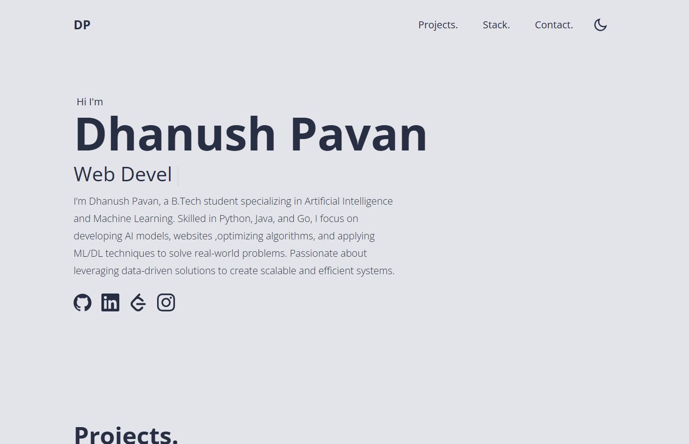
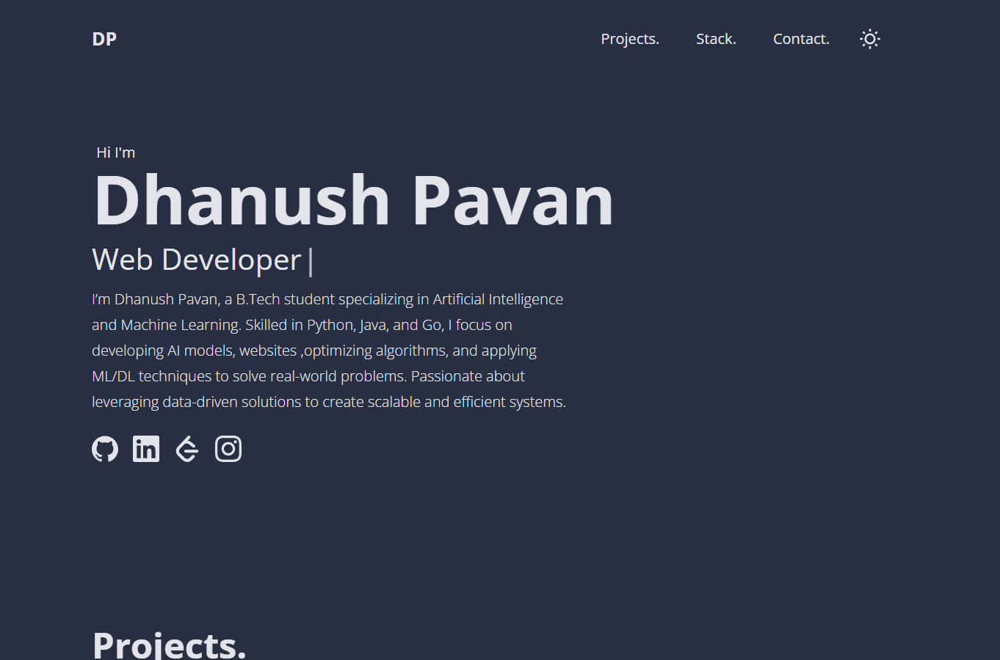
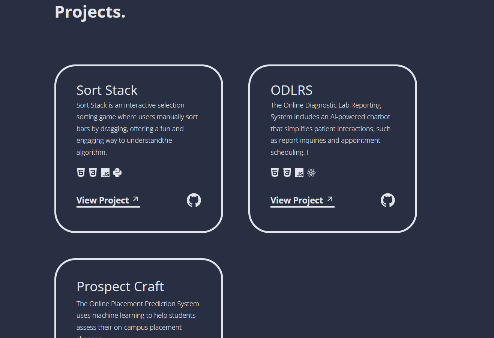
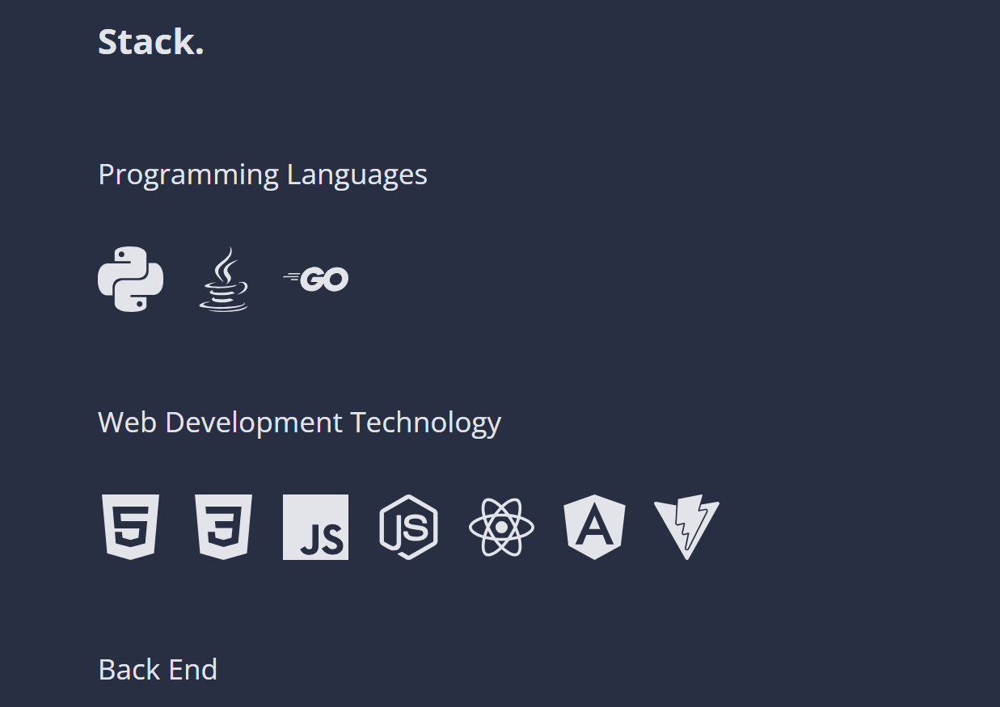
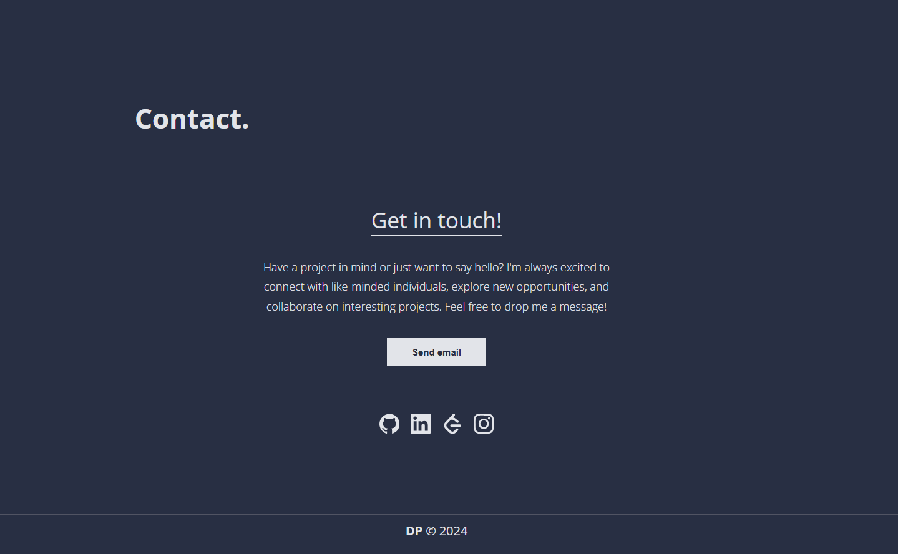

<div id="top"></div>


# Dhanush Pavan
This is a Minimal Portfolio  built with React and Vite, easy to use 









[Live Preview](https://dhanushpavann.netlify.app/)


## Prerequisites

Install NPM or PNPM
* npm
  ```sh
  npm install npm@latest -g
  ```
 
  Or
  
* pnpm
  ```sh
  npm install -g pnpm
  ```


## How to Setup

1. Clone the repo
   ```sh
   git clone https://github.com/dhanushpavann/Portfolio.git
   ```
   
2. Install NPM packages
   ```sh
   npm install
   ```
   
3. Start the development server
   ```sh
   npm run dev
   ```


## Build & deploy

1. Generate a full static production build
   ```sh
   npm run build
   ```
   
2. Preview the site as it will appear once deployed
   ```sh
   npm run preview
   ```


<p align="right">(<a href="#top">back to top</a>)</p>